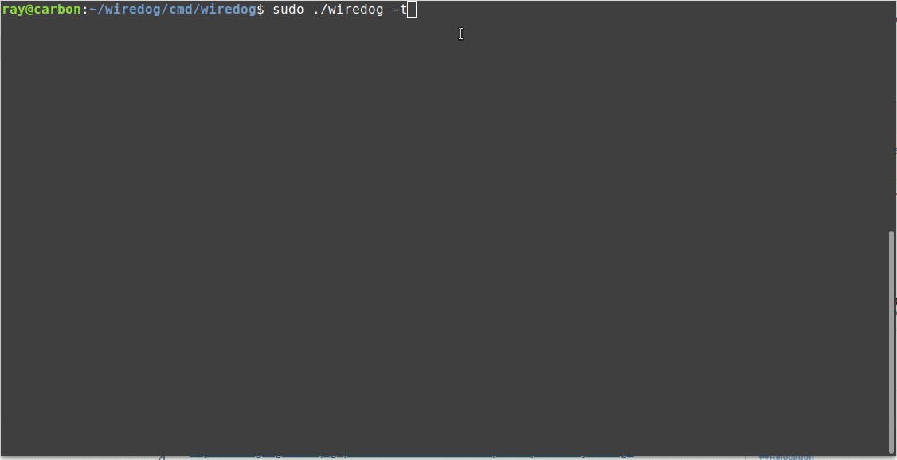

# wiredog

Wiredog monitors the local HTTP traffic by scanning the 
network packets. All network interfaces are monitored.
At least one active interface is needed.

When the requests rate for a given period exceeds a 
threshold, an alert message is displayed. The top 10 
website sections ordered by number of requests are displayed. 

Working and tested on Linux. OSX and Windows support is planned.

<p align="center">
  
</p>

```
$ wiredog -help

Wiredog is a tool for monitoring network traffic.

Only local HTTP requests are studied.
Administrator permission is required to access network devices.
Consider using sudo on Linux or get admin rights on Windows.

Usage: sudo \path\to\wiredog [flags]

  -assembly_debug_log
    	If true, the github.com/google/gopacket/tcpassembly library will log verbose debugging information (at least one line per packet)
  -assembly_memuse_log
    	If true, the github.com/google/gopacket/tcpassembly library will log information regarding its memory use every once in a while.
  -d string
    	network device name (default "wlp2s0")
  -h int
    	threshold of HTTP request hits (default 2)
  -log string
    	log directory (default ".")
  -p duration
    	time period between traffic checks (default 2m0s)
  -t	generates test HTTP requests; sets h=2 and p=2s


```

## Built With (from go.mod file)
```
Go 1.12

code.cloudfoundry.org/clock v0.0.0-20180518195852-02e53af36e6c
github.com/gizak/termui v2.3.0+incompatible // indirect
github.com/gizak/termui/v3 v3.0.0
github.com/google/gopacket v1.1.16
github.com/maruel/panicparse v1.1.1 // indirect
github.com/mattn/go-runewidth v0.0.4 // indirect
github.com/mdlayher/raw v0.0.0-20190419142535-64193704e472 // indirect
github.com/mitchellh/go-wordwrap v1.0.0 // indirect
github.com/nsf/termbox-go v0.0.0-20190325093121-288510b9734e // indirect
github.com/onsi/ginkgo v1.8.0 // indirect
github.com/onsi/gomega v1.5.0 // indirect
github.com/pkg/errors v0.8.1
github.com/tedsuo/ifrit v0.0.0-20180802180643-bea94bb476cc // indirect
```

## Thanks

gopacket and termui are cool Go packages. And of course, the Go programming language is beautiful.

## The Original Problem Statement from Datadog takehome project

Create a simple console program that monitors HTTP traffic on your machine:
Sniff network traffic to detect HTTP activity
Every 10s, display in the console the sections of the web site with the most hits (a section is defined as being what's before the second '/' in a URL. i.e. the section for "http://my.site.com/pages/create' is "http://my.site.com/pages"), as well as interesting summary statistics on the traffic as a whole.
Make sure a user can keep the console app running and monitor traffic on their machine
Whenever total traffic for the past 2 minutes exceeds a certain number on average, add a message saying that “High traffic generated an alert - hits = {value}, triggered at {time}”
Whenever the total traffic drops again below that value on average for the past 2 minutes, add another message detailing when the alert recovered
Make sure all messages showing when alerting thresholds are crossed remain visible on the page for historical reasons.
Write a test for the alerting logic
Explain how you’d improve on this application design

You have as much time as you need, but usually this takes about a week.

## Influenced by 

https://github.com/davidHuie/hsniff/

## Useful links

https://www.devdungeon.com/content/packet-capture-injection-and-analysis-gopacket

https://medium.com/@cjoudrey/capturing-http-packets-the-hard-way-b9c799bfb6

https://stackoverflow.com/questions/21145781/how-do-you-use-the-tcp-assembly-package-in-gopacket


